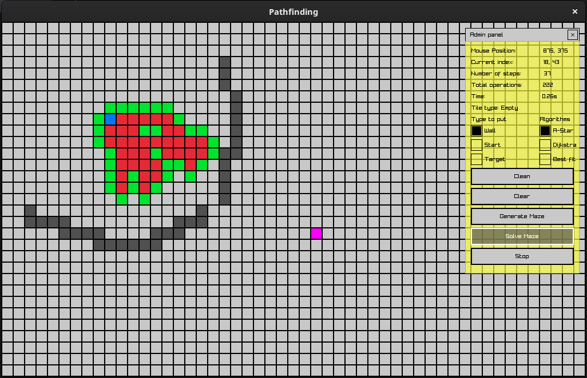
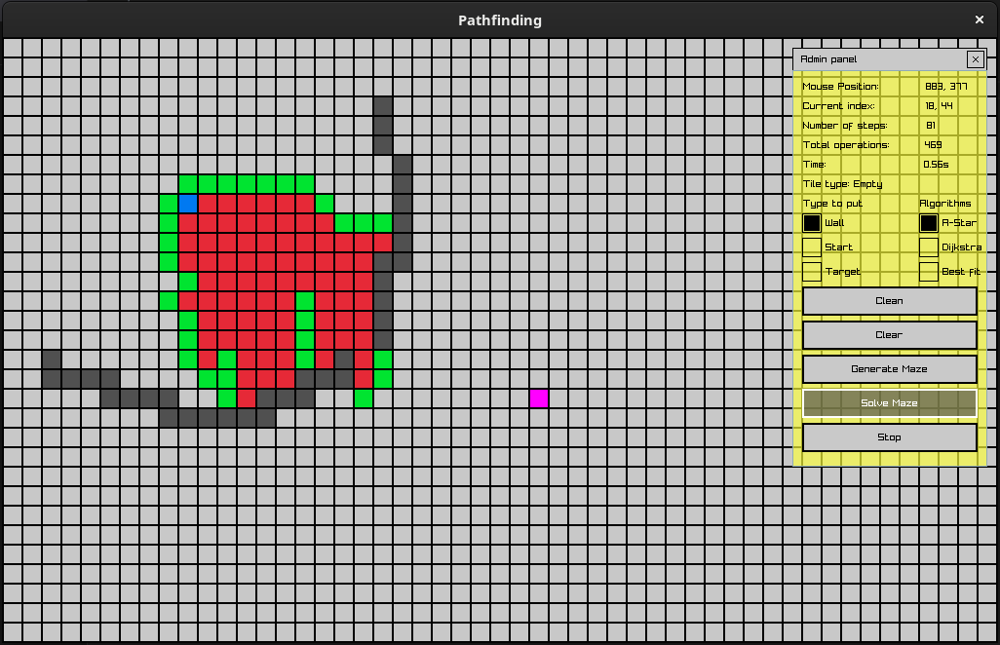
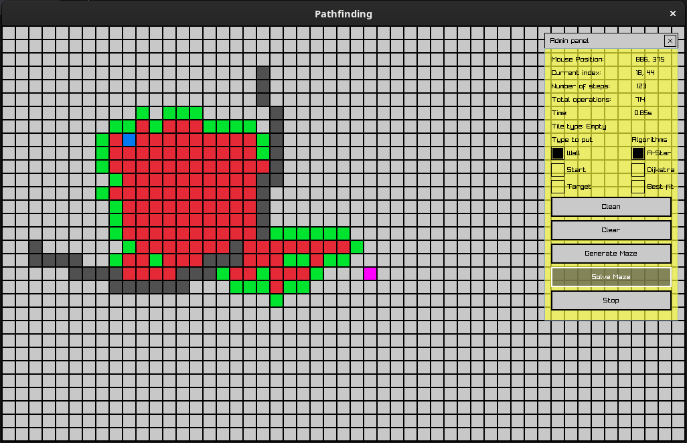
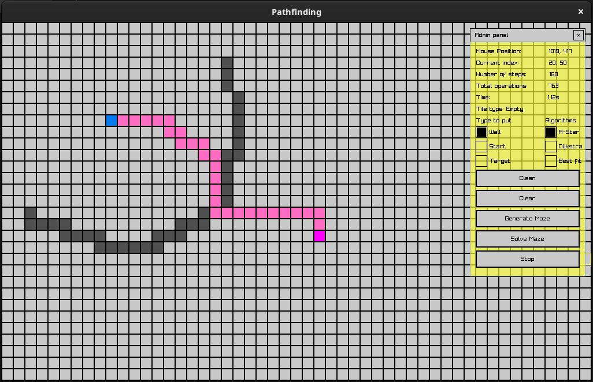

# Pathfinding
## Description
**<span style="color: red;">You don't need to install any library for this project, libs are within the project as submodules.</span>**
This is a simple project trying to implement different kind of pathfinding algorithms in an editor.
<table>
  <tr>
    <td></td>
    <td></td>
  </tr>
  <tr>
    <td></td>
    <td></td>
  </tr>
</table>

## Project Status

🚧 This project is currently under construction. 🚧

## Development Setup on Linux - Debian

### Installing Compilers

- **Clang:**
  ```bash
  wget https://apt.llvm.org/llvm.sh
  chmod +x llvm.sh
  sudo ./llvm.sh <version number>
  ```
- **GNU Compiler (Optional):**
  ```bash
  sudo apt install g++
  ```
- **CMake:**
  ```bash
  sudo apt install cmake
  ```
- **Ninja Build System:**
  ```bash
  sudo apt install ninja-build
  ```

### Installing raylib dependecies

For this project raylib will come as a submodule so you don't need to install it on your system, it will be compiled locally within this project.  
In order to compile raylib you still need to install some system dependecies:
  ```bash
  sudo apt install libasound2-dev libx11-dev libxrandr-dev libxi-dev libgl1-mesa-dev libglu1-mesa-dev libxcursor-dev libxinerama-dev
  ```
If you wan't to use your own local raylib installation, you can refer to the [raylib installation guide for Linux](https://github.com/raysan5/raylib/wiki/Working-on-GNU-Linux) for detailed instructions.  
Keep in mind that if you use your own raylib you will need to tweak the cmake build of this project.  

### Build the project

- **Clone the submodules:**
```bash
git submodule update --init --recursive
```

- **Build the dependencies:**
```bash
./build_submodules.sh
```

- **Build the final binary:**
```
mkdir build
cd build
cmake -G "Ninja" ..
cmake --build . --target all
```

## Logging

By default, the `LOGGING` option is set to `ON` in the CMake build. This enables logging throughout the game code, which can be useful for debugging and troubleshooting.

If you wish to disable logging, you can set the `LOGGING` option to `OFF` when running CMake. For example, if you're using the command line, inside your build folder you can run:  
```
cmake -G "Ninja" -DLOGGING=OFF .
```

Alternatively, if you're using an IDE such as Visual Studio or CLion, you can configure the `LOGGING` option in the CMake settings.

Note that disabling logging can improve the performance of the game, but may make it more difficult to diagnose issues if they arise. It's recommended to leave logging enabled during development and testing, and disable it only for production builds.

## Used Submodules

- [raysan5/raylib - 4.5.0](https://github.com/raysan5/raylib/tree/4.5.0)
- [raysan5/raygui - 4.0](https://github.com/raysan5/raygui/tree/3.2)
- [gabime/spdlog - v1.11.0](https://github.com/gabime/spdlog/tree/v1.11.0)
